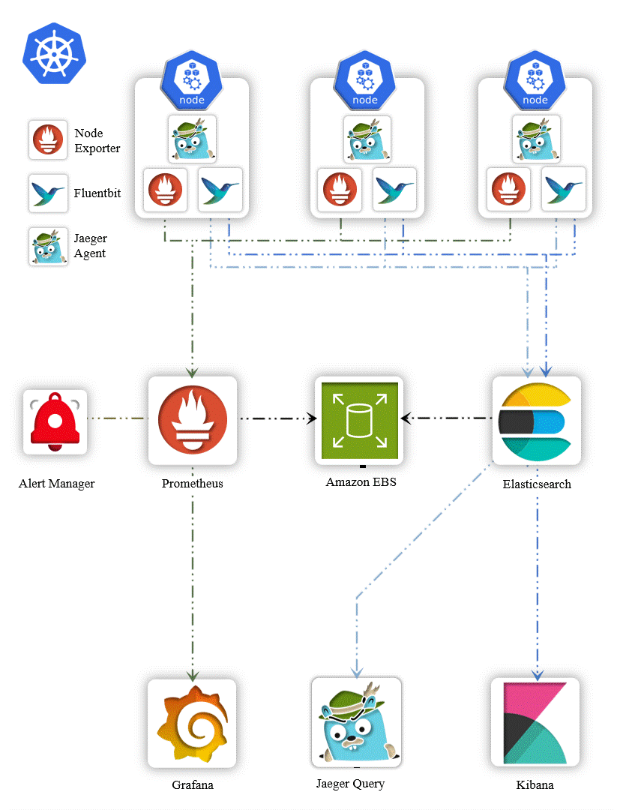
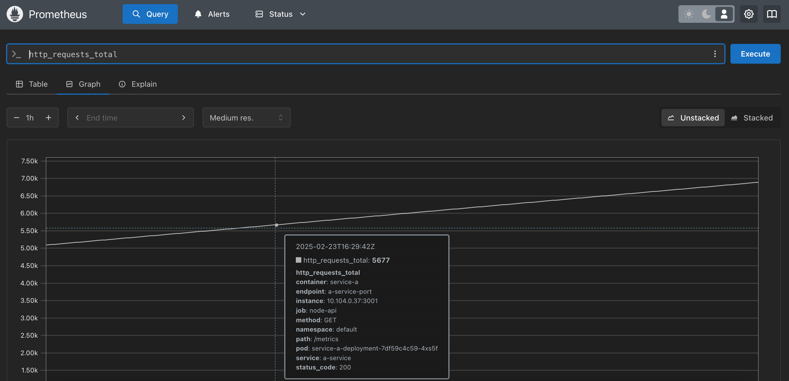
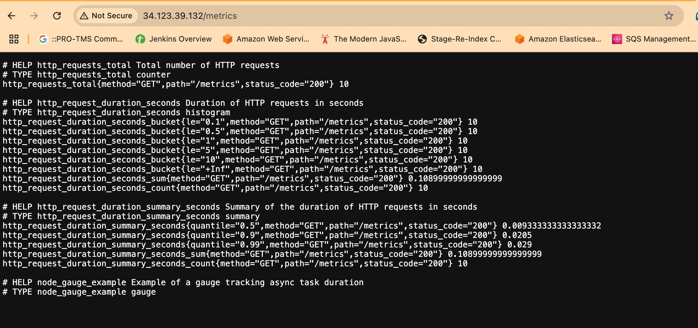
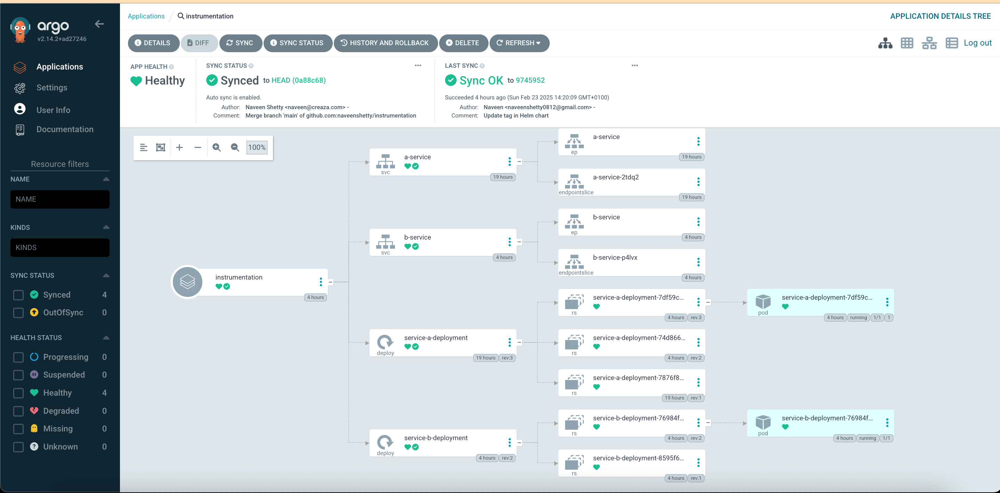

## This project gives the insight about Instrumentation 

## 🎛️ Instrumentation
- Instrumentation refers to the process of adding monitoring capabilities to your applications, systems, or services.
- This involves embedding/Writting code or using tools to collect metrics, logs, or traces that provide insights into how the system is performing.

## 🎯 Purpose of Instrumentation:
- **Visibility**: It helps you gain visibility into the internal state of your applications and infrastructure.
- **Metrics Collection**: By collecting key metrics like CPU usage, memory consumption, request rates, error rates, etc., you can understand the health and performance of your system.
- **Troubleshooting**: When something goes wrong, instrumentation allows you to diagnose the issue quickly by providing detailed insights.

## ⚙️ How it Works:
- **Code-Level Instrumentation**: You can add instrumentation directly in your application code to expose metrics. For example, in a `Node.js` application, you might use a library like prom-client to expose custom metrics.

## 📈 Instrumentation in Prometheus:
- 📤 **Exporters**: Prometheus uses exporters to collect metrics from different systems. These exporters expose metrics in a format that Prometheus can scrape and store.
    - **Node Exporter**: Collects system-level metrics from Linux/Unix systems.
    - **MySQL Exporter (For MySQL Database)**:  Collects metrics from a MySQL database.
    - **PostgreSQL Exporter (For PostgreSQL Database)**: Collects metrics from a PostgreSQL database.
- 📊 **Custom Metrics**: You can instrument your application to expose custom metrics that are relevant to your specific use case. For example, you might track the number of user logins per minute.

## 📈 Types of Metrics in Prometheus
- 🔄️ **Counter**:
    - A Counter is a cumulative metric that represents a single numerical value that only ever goes up. It is used for counting events like the number of HTTP requests, errors, or tasks completed.
    - **Example**: Counting the number of times a container restarts in your Kubernetes cluster
    - **Metric Example**: `kube_pod_container_status_restarts_total`

- 📏 **Gauge**:
    - A Gauge is a metric that represents a single numerical value that can go up and down. It is typically used for things like memory usage, CPU usage, or the current number of active users.
    - **Example**: Monitoring the memory usage of a container in your Kubernetes cluster.
    - **Metric Example**: `container_memory_usage_bytes`

- 📊 **Histogram**:
    - A Histogram samples observations (usually things like request durations or response sizes) and counts them in configurable buckets.
    - It also provides a sum of all observed values and a count of observations.
    - **Example**: Measuring the response time of Kubernetes API requests in various time buckets.
    - **Metric Example**: `apiserver_request_duration_seconds_bucket`

- 📝 Summary:
    - Similar to a Histogram, a Summary samples observations and provides a total count of observations, their sum, and configurable quantiles (percentiles).
    - **Example**: Monitoring the 95th percentile of request durations to understand high latency in your Kubernetes API.
    - **Metric Example**: `apiserver_request_duration_seconds_sum`


# 🎯 Project Objectives
- 🛠️ **Implement Custom Metrics in Node.js Application**: Use the prom-client library to write and expose custom metrics in the Node.js application.
- 🚨 **Set Up Alerts in Alertmanager**: Configure Alertmanager to send email notifications if a container crashes more than two times.
- 📝 **Set Up Logging**: Implement logging on both application and cluster (node) logs for better observability using EFK stack(Elasticsearch, FluentBit, Kibana).
- 📸 **Implement Distributed Tracing for Node.js Application**: Enhance observability by instrumenting the Node.js application for distributed tracing using Jaeger. enabling better performance monitoring and troubleshooting of complex, multi-service architectures.

# 🏠 Architecture


## 1) Write Custom Metrics
- Please take a look at `Application/service-a/index.js` file to learn more about custom metrics. below is the brief overview
- **Express Setup**: Initializes an Express application and sets up logging with Morgan, Morgan is a logging middleware for Express that logs HTTP requests made to the server.It provides detailed logging about the incoming requests, including the request method, URL, status code, and the response time.
- **Logging with Pino**: Defines a custom logging function using Pino for structured logging.Pino is a high-performance, low-overhead logging library for Node.js. It's used to log messages from application, such as debugging information, errors, or general application events.
- **Prometheus Metrics with prom-client**: Integrates Prometheus for monitoring HTTP requests using the prom-client library:
    - `http_requests_total`: counter
    - `http_request_duration_seconds`: histogram
    - `http_request_duration_summary_seconds`: summary
    - `node_gauge_example`: gauge for tracking async task duration
### Basic Routes:
- `/` : Returns a "Running" status.
- `/healthy`: Returns the health status of the server.
- `/serverError`: Simulates a 500 Internal Server Error.
- `/notFound`: Simulates a 404 Not Found error.
- `/logs`: Generates logs using the custom logging function.
- `/crash`: Simulates a server crash by exiting the process.
- `/example`: Tracks async task duration with a gauge.
- `/metrics`: Exposes Prometheus metrics endpoint.
- `/call-service-b`: To call service b & receive data from service b

## 2) dockerize & push it to the registry
- To containerize the applications and push it to your Docker registry.


## 3) Kubernetes manifest
- Review the Kubernetes manifest files located in `/k8s`.
- Apply the Kubernetes manifest files to your cluster by running/useed helm chart and argocd via CICD to update image tag :
```bash
kubectl create ns dev

kubectl apply -k k8s/
```

## 4) Install argocd on cluster step mentioned `/gitops/argocd/`

## 5) Install kube-prometheus-stack
```bash
helm repo add prometheus-community https://prometheus-community.github.io/helm-charts
helm repo update
kubectl create ns monitoring
helm install monitoring prometheus-community/kube-prometheus-stack \
-n monitoring \
-f ./custom_kube_prometheus_stack.yml
```
## 6) Verify the Installation
```bash
kubectl get all -n monitoring
kubectl port-forward service/prometheus-operated -n monitoring 9090:9090
```

## 7) Grafana UI: password is prom-operator, u-admin
```bash
kubectl port-forward service/monitoring-grafana -n monitoring 8080:80
```
## 8) Alertmanager UI:
```bash
kubectl port-forward service/alertmanager-operated -n monitoring 9093:9093
```


## Note- we can use ingress insted of doing port forwarding 
# Install Nginx Ingress Controller on k8s cluster
# Deploy the below manifest
```bash
`kubectl apply -f https://raw.githubusercontent.com/kubernetes/ingress-nginx/controller-v1.11.1/deploy/static/provider/aws/deploy.yaml`
```
# Make sure ingress controller is running , then apply below yaml into cluster
```bash
`kubectl apply -f ingress_kube_prom_stack.yaml
```


## 9) helm chart can be found in `/helm/instrumentation-chart`

## 10) created a CICD file for each service-a and service-b separate , can be found in  `.github/workflows/`.make sure when we made chnages on specific application it will trigger that pipeline and deployed to cluster.

## 11) Test all the endpoints
- Open a browser and get the LoadBalancer DNS name & hit the DNS name with following routes to test the application:
    - `/`
    - `/healthy`
    - `/serverError`
    - `/notFound`
    - `/logs`
    - `/example`
    - `/metrics`
    - `/call-service-b`
- Alternatively, you can run the automated script `test.sh`, which will automatically send random requests to the LoadBalancer and generate metrics:
```bash
./test.sh <<LOAD_BALANCER_DNS_NAME>>
```

## 12) Configure Alertmanager
- Review the Alertmanager configuration files located in `/alerts-alertmanager-servicemonitor-manifest`
    - Before configuring Alertmanager, we need credentials to send emails. For this project, we are using Gmail, but any SMTP provider like AWS SES can be used. so please grab the credentials for that.
    - Open your Google account settings and search App password & create a new password & put the password in `day-4/alerts-alertmanager-servicemonitor-manifest/email-secret.yml`
    - One last thing, please add your email id in the `alerts-alertmanager-servicemonitor-manifest/alertmanagerconfig.yml`
- **HighCpuUsage**: Triggers a warning alert if the average CPU usage across instances exceeds 50% for more than 5 minutes.
- **PodRestart**: Triggers a critical alert immediately if any pod restarts more than 3 times.
- Apply the manifest files to your cluster by running:
```bash
kubectl apply -k alerts-alertmanager-servicemonitor-manifest/
```
- Wait for 4-5 minutes and then check the Prometheus UI to confirm that the custom metrics implemented in the Node.js application are available:
    - `http_requests_total`: counter
    - `http_request_duration_seconds`: histogram
    - `http_request_duration_summary_seconds`: summary
    - `node_gauge_example`: gauge for tracking async task duration

## 13) Testing Alerts
- To test the alerting system, manually crash the container more than 2 times to trigger an alert (email notification).
- To crash the application container, hit the following endpoint
- `<<LOAD_BALANCER_DNS_NAME>>/crash`
- You should receive an email once the application container has restarted at least 3 times.


### For Node exporter and kube-state-exporter to get metrics from node(means vm), we should do.
# find one the virtual macgine attached to the cluster, click on VM connect via SSH in GCP ssh to browser on top of page, AWS use session manager
# collect ip address for node-exporter and kube-state-metrics, basically exporter /metrcis collect the data and store it in promethium TSDB 
```bash
kubectl get svc -n monitoring
monitoring-kube-state-metrics             ClusterIP   34.118.225.22    <none>        8080/TCP                     16h
monitoring-prometheus-node-exporter       ClusterIP   34.118.228.202   <none>        9100/TCP                     16h
curl 34.118.225.22:8080/metrics
curl 34.118.228.202:9100/metrics 
```


## For logging Elastic Search
#  Create Namespace for Logging

```bash
kubectl create namespace logging
helm repo add elastic https://helm.elastic.co

helm install elasticsearch \
 --set replicas=1 \
 --set volumeClaimTemplate.storageClassName=standard \
 --set persistence.labels.enabled=true elastic/elasticsearch -n logging
```

## Some screenshot





Access ArgoCD with 
http://34.44.5.6/


## 📝 Step-by-Step Setup For EFK stack 

### 1) Create IAM Role for Service Account
```bash
eksctl create iamserviceaccount \
    --name ebs-csi-controller-sa \
    --namespace kube-system \
    --cluster observability \
    --role-name AmazonEKS_EBS_CSI_DriverRole \
    --role-only \
    --attach-policy-arn arn:aws:iam::aws:policy/service-role/AmazonEBSCSIDriverPolicy \
    --approve
```
- This command creates an IAM role for the EBS CSI controller.
- IAM role allows EBS CSI controller to interact with AWS resources, specifically for managing EBS volumes in the Kubernetes cluster.
- We will attach the Role with service account

### 2) Retrieve IAM Role ARN
```bash
ARN=$(aws iam get-role --role-name AmazonEKS_EBS_CSI_DriverRole --query 'Role.Arn' --output text)
```
- Command retrieves the ARN of the IAM role created for the EBS CSI controller service account.

### 3) Deploy EBS CSI Driver
```bash
eksctl create addon --cluster observability --name aws-ebs-csi-driver --version latest \
    --service-account-role-arn $ARN --force
```
- Above command deploys the AWS EBS CSI driver as an addon to your Kubernetes cluster.
- It uses the previously created IAM service account role to allow the driver to manage EBS volumes securely.

### 4) Create Namespace for Logging
```bash
kubectl create namespace logging
```

### 5) Install Elasticsearch on K8s

```bash
helm repo add elastic https://helm.elastic.co

helm install elasticsearch \
 --set replicas=1 \
 --set volumeClaimTemplate.storageClassName=gp2 \
 --set persistence.labels.enabled=true elastic/elasticsearch -n logging
```
- Installs Elasticsearch in the `logging` namespace.
- It sets the number of replicas, specifies the storage class, and enables persistence labels to ensure
data is stored on persistent volumes.

### 6) Retrieve Elasticsearch Username & Password
```bash
# for username
kubectl get secrets --namespace=logging elasticsearch-master-credentials -ojsonpath='{.data.username}' | base64 -d
# for password
kubectl get secrets --namespace=logging elasticsearch-master-credentials -ojsonpath='{.data.password}' | base64 -d
```
- Retrieves the password for the Elasticsearch cluster's master credentials from the Kubernetes secret.
- The password is base64 encoded, so it needs to be decoded before use.
- 👉 **Note**: Please write down the password for future reference

### 7) Install Kibana
```bash
helm install kibana --set service.type=LoadBalancer elastic/kibana -n logging
```
- Kibana provides a user-friendly interface for exploring and visualizing data stored in Elasticsearch.
- It is exposed as a LoadBalancer service, making it accessible from outside the cluster.

### 8) Install Fluentbit with Custom Values/Configurations
- 👉 **Note**: Please update the `HTTP_Passwd` field in the `fluentbit-values.yml` file with the password retrieved earlier in step 6: (i.e NJyO47UqeYBsoaEU)"
```bash
helm repo add fluent https://fluent.github.io/helm-charts
helm install fluent-bit fluent/fluent-bit -f fluentbit-values.yaml -n logging
```

## ✅ Conclusion
-  Successfully installed the EFK stack in our Kubernetes cluster, which includes Elasticsearch for storing logs, Fluentbit for collecting and forwarding logs, and Kibana for visualizing logs.
- To verify the setup, access the Kibana dashboard by entering the `LoadBalancer DNS name followed by :5601 in your browser.
    - `http://LOAD_BALANCER_DNS_NAME:5601`
- Use the username and password retrieved in step 6 to log in.
- Once logged in, create a new data view in Kibana and explore the logs collected from your Kubernetes cluster.
